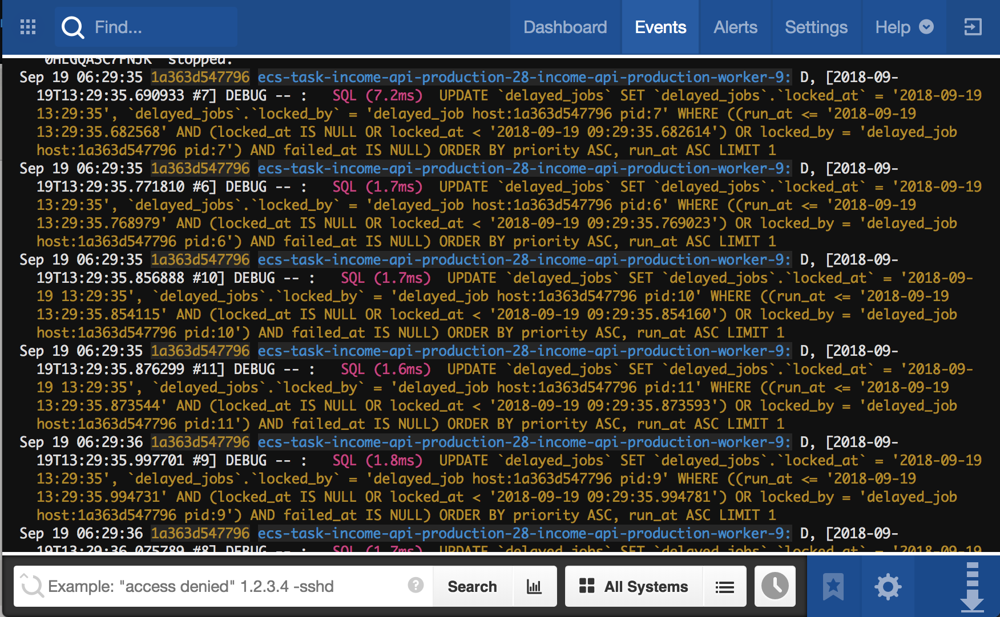
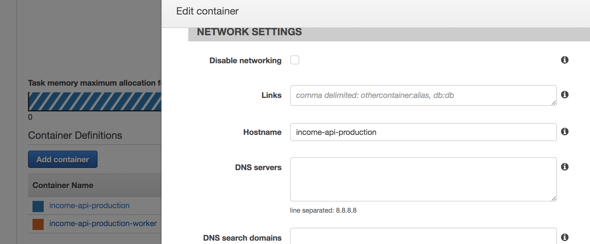
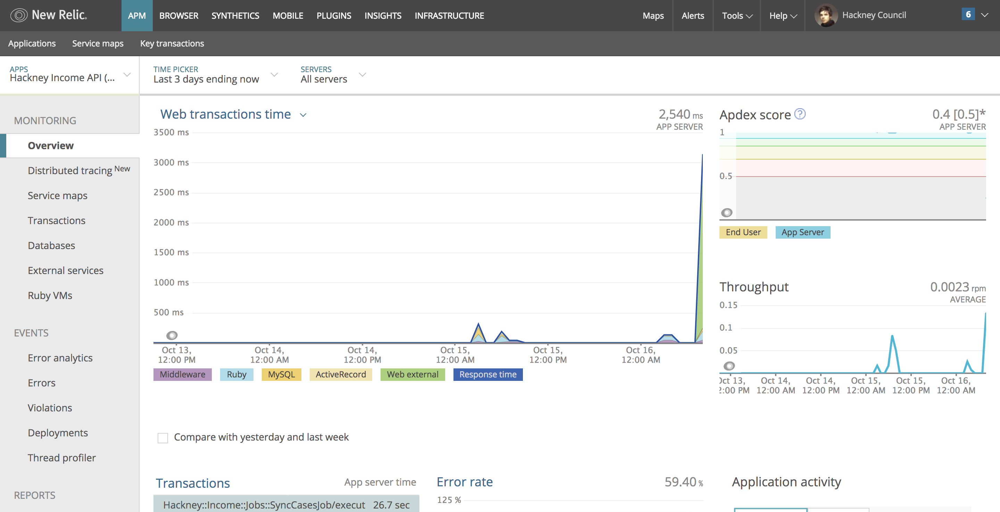

# API Playbook

## Application standards

### Open source on GitHub

> As a developer
>
> I want my code to be open source and public
>
> So I can showcase my work, get review and feedback from a wider group than just my colleagues

> As a developer outside of Hackney
>
> I want Hackney's code to be open source and public
>
> So I can be inspired by and utilise code developed at Hackney

### Test-driven approach

## Monitoring

### Centralised logging

> As a developer
>
> I want to be able to see logs for all applications in one place
>
> So I can debug problems across microservices and resolve them

> As a support analyst
>
> I want to be able to see logs for all applications in one place
>
> So I can identify errors

We use [**Papertrail**][papertrail] as a centralised log platform, as it has a good interface, is easy to use, and is well priced. It allows us to see a stream of logs from a single application, a group of applications, or all applications at once. We can easily search by common references to trace requests across microservices.

If you are deployed to the [Hackney ECS environment](#Hosting), your service will log to Papertrail automatically. You need to set the Hostname of your container to the name of your service in your task definition.

### Centralised application performance monitoring

> As a developer or a support analyst
>
> I want to able to able to see a breakdown of transactions
>
> So I can measure application performance and find performance bottlenecks

We use [**New Relic**][newrelic] as a centralised application performance monitoring tool, as it is capable of instrumenting applications in many languages, including C# and Ruby. It allows us to see requests going through an application and where time is spent during those requests. For example, if a large SQL call is what is hurting performance.

In a .NET application, you install a New Relic Agent on the machine, which will automatically instrument any .NET apps running. You can find an example of setting this up in the [Tenancy API](dotnet-newrelic-example).

In a Ruby application, you install the New Relic gem and configure it with environment variables. You can find an example of setting this up in the [Income API](ruby-newrelic-example).

### Centralised uptime monitoring

### Centralised exception logging

## Hosting

## Deployment pipeline

## Documentation standards

- Business context
- Stack
- Installation
- Development practices
- Release process
- Deployment pipeline
- Common problems
- Useful contacts
- API endpoints (probably to come automatically)

[papertrail]: http://example.com
[newrelic]: http://example.com
[dotnet-newrelic-example]: http://example.com
[ruby-newrelic-example]: http://example.com
