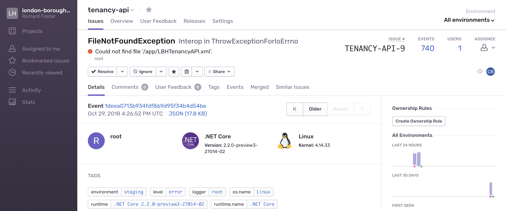
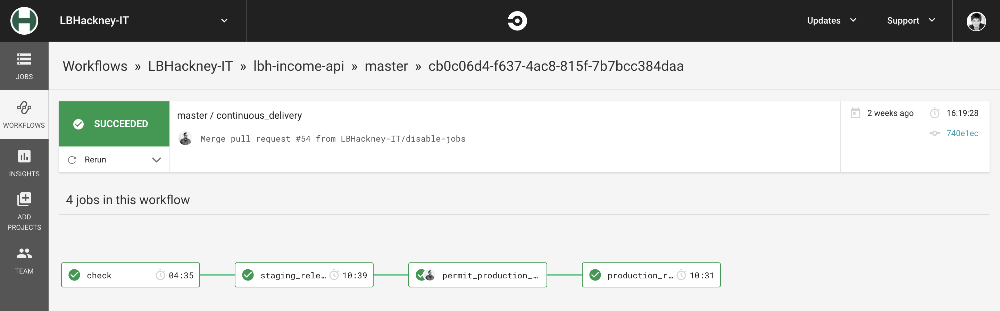

# API Playbook

A guide on Hackney's development practices, and how to follow them.

## Application standards

### Open source on GitHub

> As a developer
>
> I want my code to be open source and public
>
> So I can showcase my work and contribute to the wider community

Our mission is to open source 100% of our code, and start in the open whenever starting new projects. All of our code repositories are on GitHub, over half are currently open source.

By employing a [12 Factor](#12-factor) methodology, we keep any secrets such as API tokens outside of our repositories, and instead injected as environment variables in trusted runtime environments. This allows us to write code which interacts with private systems without exposing information.

### Test-driven approach

We use Test Driven Development discipline when writing new code, as it makes it easier to build functionality progressively, helps reduce error rate in production, and helps prevent against feature regressions after changes.

- why we use tdd practice
- resources for learning tdd
- (triangulation)
- how to use a test suite to ensure quality is high

## Monitoring

### Centralised logging

> As a developer
>
> I want to be able to see logs for all applications in one place
>
> So I can debug problems across microservices and resolve them

> As a support analyst
>
> I want to be able to see logs for all applications in one place
>
> So I can identify errors

We use [**Papertrail**][papertrail] as a centralised log platform, as it has a good interface, is easy to use, and is well priced. It allows us to see a stream of logs from a single application, a group of applications, or all applications at once. We can easily search by common references to trace requests across microservices.

If you are deployed to the [Hackney ECS environment](#hosting), your service will log to Papertrail automatically. You need to set the Hostname of your container to the name of your service in your task definition.

### Centralised application performance monitoring

> As a developer or a support analyst
>
> I want to able to able to see a breakdown of transactions
>
> So I can measure application performance and find performance bottlenecks

We use [**New Relic**][newrelic] as a centralised application performance monitoring tool, as it is capable of instrumenting applications in many languages, including C# and Ruby. It allows us to see requests going through an application and where time is spent during those requests. For example, if a large SQL call is what is hurting performance.

In a .NET application, you install a New Relic Agent on the machine, which will automatically instrument any .NET apps running. You can find an example of setting this up in the [Tenancy API](dotnet-newrelic-example).

In a Ruby application, you install the New Relic gem and configure it with environment variables. You can find an example of setting this up in the [Income API](ruby-newrelic-example).

<!-- ### Centralised uptime monitoring

- pingdom
- alerts responsible team members when the site goes down
- useful as a maintainer because you know when to take action -->

### Centralised exception logging

We use [**Sentry**][sentry] as a centralised exception logging platform, as it's able to receive exceptions from many languages, including C# and Ruby, and has good tooling around releases. It logs every error which occurs in any of our systems, attaching metadata including which user experienced the error, what request they were trying to make, how many times that error has occurred, and which code release likely introduced the error.

It is very useful for developers/maintainers to investigate and fix application errors, including more information to aid diagnosis than stack traces in logging will.

In a .NET application, you install a Sentry package using NuGet and use it to send messages to Sentry when handling uncaught exceptions. You can find an example of this in the [Tenancy API](dotnet-sentry-example).

In a Ruby application, you install the Sentry gem and configure it to add additional context. You can find an example of setting this up in the [Income API](ruby-sentry-example).

### 12 Factor

We follow 12 Factor principles when building new applications. You can find out more about why [in our 12 Factor documentation][12-factor-documentation].

Following these principles allows our applications to be platform agnostic, meaning we're not tied down to running them on any specific vendor's platform, and don't have to make changes to application code in order to migrate them somewhere else.

## Containers

We use Docker containers when building new applications to allow them to be run anywhere without tedious environment set up. We run the both in development and in hosted environments, such as production environments.

We define `Dockerfile`s for each of our applications, generally building from a base language specific image, installing necessary system tools for our application to run, copying files onto the image and compiling the application. The built image can then be used in both development and production, as well as other hosted environments.

In production any external systems we talk to will be managed and hosted separately, for example a database, or a webservice.

However, in development, we generally want to start up these development versions of these services at the same time as our application. We use `docker-compose` for this, to define dependencies when running locally and start them up as a cluster. This ensures all developers are running in reasonable parity with production when developing the application.

We also use Docker when building tools, such as simulators, without a specific custom application. It makes it easy to build and distribute an image which applications can use as a dependency.

For an example of using Docker with .NET Core, see the [Tenancy API][tenancy-api].

For an example of using Docker with Ruby, see the [Income API][income-api].

For an example of using Docker with other tools, see the [Universal Housing Simulator][universal-housing-simulator] which creates and starts a SQL Server instance.

## Hosting

### ECS

We use ECS on AWS to run Docker containers in the cloud. This allows us to use the same Docker containers we use in development, for actually serving in production. ECS orchestrates deployments of new images, running them on our own EC2 machines.

ECS is a fairly simple and cost effective approach to running Docker in production, and allows us to run containers within our AWS VPC, which has a VPN connection to the Hackney network. It can also be securely connected to our AWS API Gateway without making the EC2 instances public, meaning they are more secure.

Currently there is a bit of manual work to set up a new application on ECS, or to update configuration of an application hosted on ECS. This is because we were initially just trialling the service. We will be using Terraform and JSON configuration to provision our AWS environment soon, which will make it easier for developers to add new apps to the platform, and update their settings.

Speak to one of the following for more information on getting set up with ECS:

- Richard Foster - Lead Engineer at [Made Tech][made-tech] (richard@madetech.com)
- Rashmi Shetty - Development Manager at London Borough of Hackney (rashmi.shetty@hackney.gov.uk)

### API Gateway

We use AWS API Gateway to handle requests coming into our platform, validate them, and direct them to the correct application.

For example, a request to `/income/api/v1/my-cases` will be directed to the `/api/v1/my-cases` route of the Income API.

Authentication occurs inside the API Gateway too, validating that inbound requests have a valid API Token header, and forbidding them if not. Authenticated requests will be passed onto a load balancer via a VPC Link, which will then pass it onto the most appropriate application server.

We do not currently have a domain for the platform, but are planning to soon.

### Developing for ECS

We use a VPN connection between our AWS VPC (Virtual Private Cloud) and the Hackney on-premises network. This permits ECS access to services, databases and webservices hosted on premises. We restrict IP ranges of available services, so you may need to adjust this if you require access to a service that hasn't been used from ECS before.

Talk to the infrastructure team if you do.

### Future

Because all applications should be containerised, we can change the hosting provider with minimal to no interruption of service, and no application code change.

We are currently considering Kubernetes on AWS as an alternative to ECS. We also might replace AWS API Gateway with a more feature rich gateway.

<!-- ### Past

- trialled Heroku Enterprise -->

## Deployment pipeline

We use CircleCI workflows as deployment pipelines. This gives us a single standard method of deploying to production, with automated steps reducing room for human error.

Using this workflow enforces automated checks run before releasing to staging or production. For example, tests must pass, linting must pass, and there must be no obvious vulnerabilities. Otherwise the developer will have to fix any issues before trying again.

This workflow means staging must be deployed before production, and a developer must approve a production release. This makes it more likely for developers to test in staging before promoting a change to production.

We typically configure four stages to a release:

1. Build and check (**Automated**)
  - Ensure the application compiles successfully (if necessary)
  - Ensure automated tests pass
  - Ensure linting passes (if available)
  - Ensure vulnerability checker passes (if available)
2. Staging Release (**Automated**)
3. Hold for Production Release confirmation (**Manual**)
4. Production Release (**Automated**)

## Documentation standards

We document our applications to include certain key information. This ensures anybody interested in our project can be guaranteed certain information, and any developer can get set up in a consistent manner.

1. **Business context.** Who was this made for? Why was this made? Who was the product owner?
2. **Stack.** What did we build this with? Why did we choose that?
3. **Installation.** How do I get set up with the application as a new developer?
4. **Development practices.** What practices should I adhere to when writing code?
5. **Release process.** When do I release to production? What should I know beforehand? How to get code reviewed and approved?
6. **Deployment pipeline.** What tools do I use to release to production?
7. **Common problems.** Errors and issues developers experienced with the project will have all seen. Useful for new developers to have a reference.
8. **Useful contacts**
  - Active maintainers (developers, delivery managers, stakeholders)
  - Other contacts (developers, delivery managers, stakeholders)
  - Include name, title, company and email address for each.

You can see the [Income API][income-api] or [Tenancy API][tenancy-api] for examples of this kind of documentation.

### Swagger

We use Swagger to get human readable and simple to use API documentation. The generated documentation can be viewed and understood by more than just developers, and is useful for understanding ways we could integrate different services.

The documentation shows a list of all endpoints available in the app, with detailed documentation of inputs and outputs. Other teams can use our swagger documentation to learn how to consume our APIs

In a .NET application, you can use a NuGet package called Swashbuckle to generate Swagger documentation automatically from your typed code. You can find an example of this in the [Tenancy API][dotnet-swagger-example].

In a Ruby application you can use the `swagger-blocks` gem, which provides a DSL for defining Swagger documentation automatically. You can find an example of setting this up in the [Income API][ruby-swagger-example].

[papertrail]: http://papertrailapp.com
[newrelic]: https://newrelic.com
[tenancy-api]: https://github.com/LBHackney-IT/LBHTenancyAPI
[income-api]: https://github.com/LBHackney-IT/lbh-income-api
[dotnet-newrelic-example]: https://github.com/LBHackney-IT/LBHTenancyAPI/pull/82/files
[ruby-newrelic-example]: https://github.com/LBHackney-IT/lbh-income-api/commit/98f7c574449c732962d73c4b907daaa1ed2e9b42
[dotnet-sentry-example]: https://github.com/LBHackney-IT/LBHTenancyAPI/blob/bd56e77d10f61598be778e7b65630e7632c2afc7/LBHTenancyAPI/Infrastructure/V1/Logging/SentryLogger.cs
[ruby-sentry-example]: https://github.com/LBHackney-IT/lbh-income-api/commit/058a87b7de1a71c922ac5d9eaac9117b10df88d2
[12-factor-documentation]: https://docs.google.com/document/d/1ERHoLvT4q4xFtWzoxs3b-v3FF1aLknrFMyc4NaiT5WU/edit#heading=h.i16rhbmwmkxq
[universal-housing-simulator]: http://example.com
[made-tech]: https://www.madetech.com/
[dotnet-swagger-example]: https://github.com/LBHackney-IT/LBHTenancyAPI/blob/master/LBHTenancyAPI/Startup.cs#L65-L112
[ruby-swagger-example]: https://github.com/LBHackney-IT/lbh-income-api
