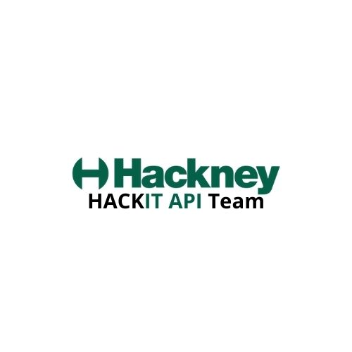

## Introduction

You can copy this repo to start a new API.
There are comments throughout the code that start with TODO where specific things need to be changed or renamed when copying this template.
Be sure to remove these comments when they aren't needed anymore.

## Our GitHub Repo

https://github.com/LBHackney-IT/lbh-base-api

## Base API Video Tutorial

** For a better understanding on how to use The Base API, please watch our tutorial below: **

<figure class="video-container">
  <iframe width="100%" src="https://www.youtube.com/embed/WggC6Rtz1CE" title="YouTube video player" frameborder="0" allow="accelerometer; autoplay; clipboard-write; encrypted-media; gyroscope; picture-in-picture" allowfullscreen></iframe>
</figure>

