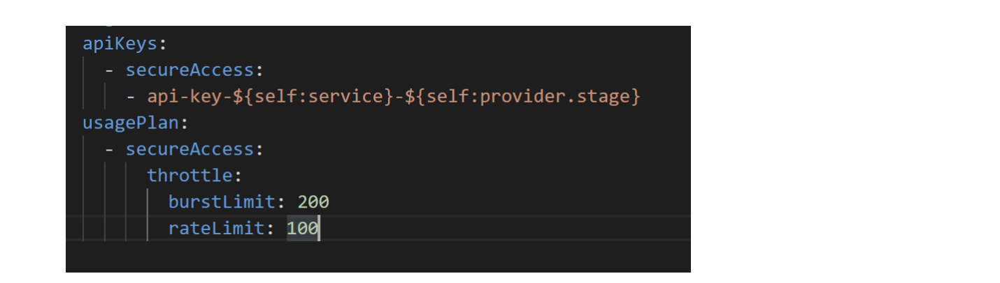

## Securing our APIs

** What to cover: **

** 1. What to use to secure our APIs (explain new solution and that it should be used going forward + some APIs still use old solution) **

** 2. Existing approach to securing our APIs **

  a. API keys - what are those and how to use

  b. Specify that when you select the option to use an API key, the API within the API Gateway needs to be deployed for the changes to apply

  c. What is a usage plan and how to use it

  d. What is a stage and how to use it

  e. Reference to serverless.yml and how by default an API key is added to each new API

  f. Link to step-by-step guide of how to apply/modify

** 3. New approach - Lambda authorizer **

  a. What is a Lambda authorizer (include AWS diagram), what is Hackney’s solution and how to use it

  b. Link to authorizer repo

  c. Flow chart to explain flow of authorizer (Hackney’s implementation for an authorizer)

  d. When to use it

  e. Link to step-by-step guide of how to apply for new APIs

** 4. Google auth (TK)  **

  a. What is it and how to use

  b. Which projects use it

  c. When to use

  d. Sample implementations?

   **  <u> Securing our APIs: </u> **

** What do we use to secure our APIs? **

We have now changed our approach to using a Lambda authorizer function to secure our APIs.

## API keys to secure our APIs

Some of our APIs still use API keys to manage access to the APIs. This was our initial approach, but it has proven to be insufficient as it does not allow for granular access control and reporting, and it is associated with a big maintenance overhead.

AWS documentation on API keys and Usage plans:

            https://docs.aws.amazon.com/apigateway/latest/developerguide/api-gateway-api-usage-plans.html

## What is an API key?

An API key in this context is a solution provided by AWS for managing access when using AWS API Gateway. Each resource (endpoint) within an API can be set to require an API key to be supplied, when making a request.

When this option is enabled, the API will return a status code of 401 Unauthorized if the consumer has not supplied the API key value within an ‘x-api-key’ HTTP header.

** What is a stage? **

Before API is deployed to the API gateway, it must have a stage. Depending on the account setup, API typically has either one or three stages. If an account is set up to use one API per environment (development, staging and production), then API will have only one stage. Sometimes we have just one API for all three environments, in which case we use three different stages.

Stages are used to define the connection between the API and other AWS resources. Our stages will typically have three variables that define where the requests made for the API should go. These are: VPC link, load balancer URL and port. When the API is called, the stage name in the URL is used to direct the traffic to the specific stage in the API, which in turns then uses the stage configuration to direct the traffic to the correct AWS service.

** Typical URL for an API looks like: **

          https://{API _ID}.execute-api.{AWS_REGION}.amazonaws.com/development/api/

Development in the above URL indicates the stage that the client is trying to access.

** What is a usage plan and how to use it? **

Once the API key has been created, it can be attached to a usage plan to control its usage. Rather controlling the access from an authentication point of view, usage plans control the amount and frequency of calls that can be made to API stages using the key.

Usage plans can have multiple API keys attached to them, but we typically create a usage plan per API key and API stage. That way we have more granular control over the usage of individual API stages.

Usage plans control the quota (requests per day/week/month), rate (requests per second) and burst (capacity of a token bucket) values for the given API stage.

Throttling can be made more granular by enabling method throttling for a stage, which means that different HTTP methods for the API stage can have different limits.

## Guide for enabling and disabling API keys

Guide describing how to enable and disable API key requirement:

        https://docs.google.com/document/d/1RVJ8f4T6-2m0QqJ9xO-f15FSP7AT4xv0ts8CZGvGR6Y/edit?usp=sharing

** How are API keys added to our Lambda based APIs?  **

For any API, where we use Lambda as our hosting option, the configuration to use API keys is automated using Serverless. Each API generates its own unique key and associates it with the deployment stage.

Ref:

        https://github.com/LBHackney-IT/lbh-base-api/blob/59df843bf70d1ec20bbf7420f2e80c881e789dfc/BaseApi/serverless.yml#L8

For APIs that use EC2/Fargate, we create and add API keys via Terraform.
