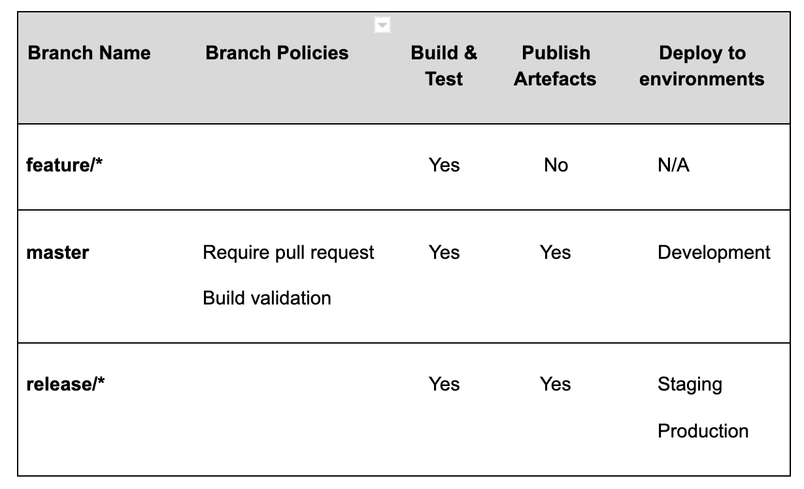

## Development

** GitHub is used for version control and source code management. **

** When a new repository is created: **

  1. Use the lbh-base-api template if creating a new API

  2. Ensure you set the project up on CircleCI for CI/CD

  3. By default, repositories should be kept public, unless there is a specific need and justification not to do so.

## Branch Definitions

  ** GitFlow **

Note: GitFlow is not strictly followed throughout projects, projects can evaluate and choose a branching strategy suitable for their needs.

** Master branch **

The branch that holds the code currently in production;

This branch should be a representation of what is running in production (although that might not be a case if a deployment to staging has happened but has not been released to production yet);

** Development branch **

The branch that holds any changes currently in development stage that are not yet pushed to a staging or production environment;

If using development and master branches, a release to Staging/Production environments happens by a PR from development to master;

** Feature branch **

A branch containing any new changes as per requirements for the given project;

A feature branch should be created from the ‘development’ branch;

Once happy with the changes in the feature branch, a pull request to merge the changes into the ‘development’ branch should be made.

** Hot-fix branch **

A branch containing fixes to code already in production state;

A hot-fix branch should be created from the master branch;

Any changes in the hot-fix branch should be merged into the master branch following a pull request review;

Hot-fixes applied should be merged directly to master as this triggers separate CircleCI workflow that will ensure that any changes currently in development are not overwritten;

## Trunk Based Development  

(https://trunkbaseddevelopment.com/) **

Trunk based development is the most common branching strategy used for a microservice architecture. This is a fast workflow with minimal merging.
Essentially in this model, master is the only branch which is maintained over time and other branches are considered transient and short lived.

Feature branches should be as short lived as possible – the longer the branch is open for then the higher the risk of merge conflicts.

All commits to feature branches should be built and tested on the CI/CD platform to provide fast feedback to developers, and any code being merged into the trunk must go through a pull-request peer review process. Typically feature branches do not publish any artefacts or trigger deployments as these slow down the feedback process.

The cadence of release branches should align with an individual’s services release schedule. Some projects may only create release branches at the end of a sprint, whilst others might create several per-week.

Trunk-based development is a mindset more than a practice.  It forces the developers to think early on about how not to break the build, instead of waiting to think about this when merging the branch.
Trunk-based development becomes more natural to adopt when you use feature flags in your continuous integration pipeline.  
Feature flags is a technique that will help you integrate code into a shared repository at least once a day and ship it,
even if you haven't finished the feature yet. You'll be able to deploy at any time,
but defer the decision to release for another day.  Turn off the feature flag and let the team continue working with a stable version and a healthy build.

## Environments

** Pull requests: **

All tests need to be passing prior to merging code

GitHub PR template needs to be completed as detailed as possible, including a link to the JIRA ticket of the work done

There needs to be a minimum of 1 approver per PR prior to merging

## Continuous testing:

At Hackney, unit and integration tests must be run as part of the CI/CD pipeline at the point of:

1. Code committed to remote branch
2. Deployment to different environments

  We use Test Driven Development (TDD) approach when writing code.
  Each project’s test suite must include tests produced as part of TDD as well as integration tests.

** More on practices in Hackney for writing tests here: [Link TBC in API playbook] **

## APIs

For APIs, we use docker-compose to build image(s) and run the test suite.

For the purpose of end-to-end tests, we create a docker image of a database to run tests against

## Continuous Integration and Deployment

Once a pull request has been merged, it will trigger a CircleCI workflow to automatically deploy to Development, Staging and Production respectively.

** Note: Deployment to Production requires a manual approval step within CircleCI first. **

## Development workflow

Merging into a ‘development’ branch triggers the ‘development deployment’ workflow:

## Staging and Production workflow

Merging into the ‘master’ branch automatically deploys to the staging environment. For production release, a manual approval stage in CircleCI is required.

## Continuous monitoring

AWS CloudWatch

Used for Application monitoring

Using alarms for when errors occur

Using Canaries for up-time monitoring

Integrated with slack channel to get notifications when an alarm is triggered

  **  More on monitoring can be found in our API Playbook [Link TBC] **

## AWS Cloudtrail

Used to monitor activities within our AWS accounts

## AWS Security Hub

Using AWS Security Hub to ensure our accounts are safe and resources adhere to AWS best security practices

Alerts us when a security configuration rule compliance has changed

## Infrastructure as code (IaC)

      More on IaC in our API playbook here [Link TBC]]

Each API is responsible for maintaining its own infrastructure.

Our IaC deployment process is automated via our CI/CD pipeline.

## Serverless framework

We use the serverless framework to help us deploy Lambda functions and related resources.

The serverless framework configuration is stored within a serverless.yml file and should be responsible for provisioning resources related directly to the Lambda function that is to be deployed.

API Gateway for exposing the APIs

Lambda IAM role;

Although serverless allows for other AWS resources to be provisioned using IaC approach, we use Terraform for provisioning other resources, such as DMS (Data migration service) tasks, S3 buckets, etc.

## Terraform

Used for provisioning all other AWS resources, apart from the Lambda related resources listed above.

Terraform Hackney Guide - Note: This will be evolving from its current state as currently the Cloud Deployment team are producing more Terraform templates.

