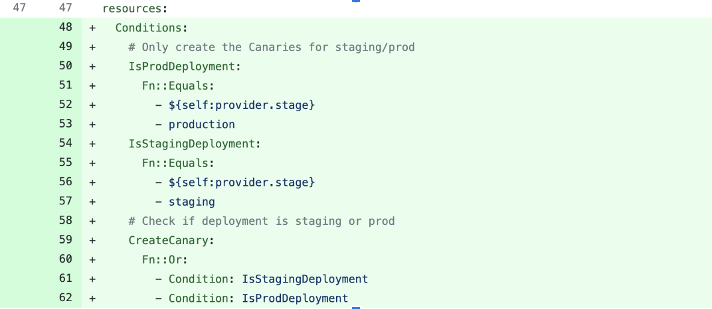
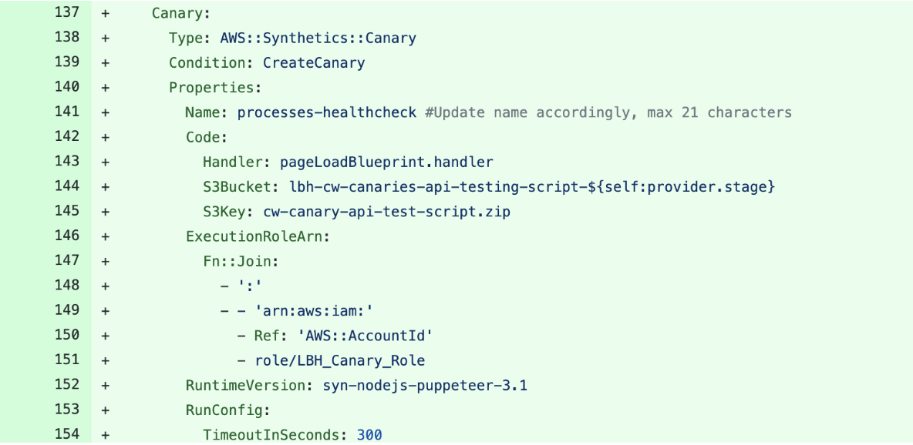
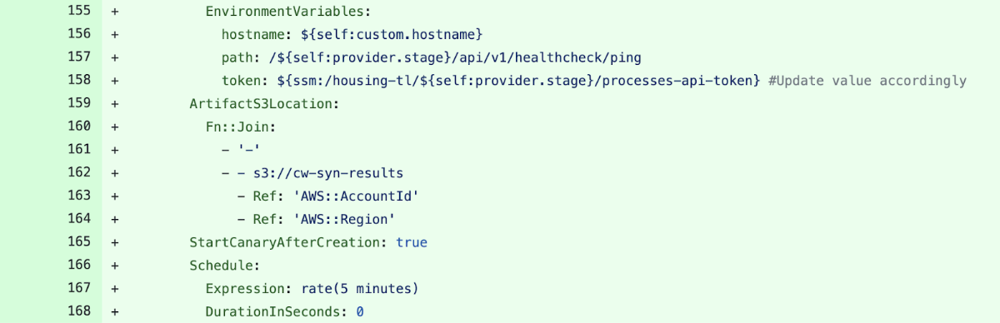

import TextToSpeech from '../src/SpeechComponent.js';

<TextToSpeech>

## Introduction:

What is AWS Canaries?

Canaries are programmable scripts that follow the same paths and do the same activities as customers, allowing you to validate your customer experience even when there is no client traffic on your apps. Canaries can be set to run on a set schedule.

According to Amazon,  “Canaries are scripts written in Node.js or Python. They create Lambda functions in your account that use Node.js or Python as a framework. Canaries work over both HTTP and HTTPS protocols.”
## The benefits:

- Canaries check the availability and latency of your endpoints; 
- It can store load time data and screenshots of the UI;
- They monitor your REST APIs, URLs, and website content;
- They can check for unauthorised changes from phishing, code injection and cross-site scripting;
## Why Canaries if useful for Hackney?:

As software deployments move at scale and velocity it becomes crucial to have a proper system in place that assess these releases before they damage the production environment leading to losses for our Organisation. Canary deployments provide an excellent approach to reducing the risk of introducing a defect into production, are relatively low cost, and do not slow the process much as long as appropriate automation is involved.
## Set Up Automated Canaries - The Hackney Way:

For a detailed example of how we set up automated canaries “The Hackney Way”, please visit the Github link below:
https://github.com/LBHackney-IT/processes-api/pull/8/files

The process involves updating the serverless.yml file with the creation of canaries for both staging and production environments.
 

 We also have to ensure that the required properties are stated, including the S3Bucket and S3Key.

 

 The value for the environment variables including the host name, path and token also have to be updated accordingly. Within Hackney, we do not hard code the token instead we store the token within AWS Parameter store. This is inline with our Security compliance rules.  

We can then add some customisation for the region.

[Here is an example PR on how to automate canaries within our APIs](https://github.com/LBHackney-IT/patches-and-areas-api/pull/14/files)
## Why we have automated the process:

Canary testing fits into the continuous delivery and continuous integration methodologies.  At Hackney Council we have been doing progressive delivery deployment for a while, and recently we observed an influx in queries from our developers and stakeholders wanting to learn how the automation of canaries can:
- Keep oversight in releases: which version(s) are deployed where and are any of them having problems?;
- Compare releases and look out for architectural regressions by having transactional level version awareness;
- Detect problematic Canary deployments quickly and trigger automated remediation;
- Hackney Council integrates deep monitoring and automated testing into canary testing;
- If a feature fails a monitoring check once it’s been deployed as a canary to a percentage of users, it will automatically roll back;
- With continuous deployment and canary tests, our development team can release new functionality and code changes at scale more safely;

</TextToSpeech>