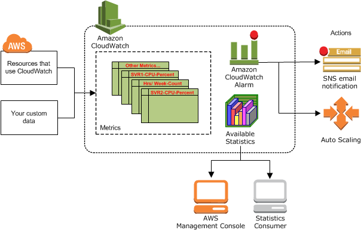
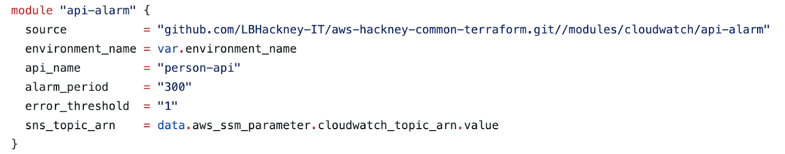

import TextToSpeech from '../src/SpeechComponent.js';

<TextToSpeech>
# CloudWatch Alarms

# Introduction

## What is CloudWatch?

According to AWS, Amazon CloudWatch is a monitoring and observability service. It provides you with data and actionable insights to monitor your applications, respond to system-wide performance changes, and optimise resource utilisation.

CloudWatch enables real-time monitoring of many AWS services such as DynamoDB, S3, API Gateway and many more. See [here](https://docs.aws.amazon.com/AmazonCloudWatch/latest/monitoring/aws-services-cloudwatch-metrics.html) for a list of services that publish metrics to CloudWatch.  These _metrics_ can be viewed on the CloudWatch console, viewed as statistics and in useful graphs. See below for a diagram of how Cloudwatch Integrates with the AWS ecosystem:




Some example metrics could be:

* The number of requests made to an API
* An API’s latency (The time between when API Gateway receives a request from a client and when it returns a response to the client.)
* SystemErrors from DynamoDB
* Error rate from CloudFront
* The number of blocked requests from AWS WAF (Web Access Firewall)

See more about CloudWatch and how we use them at Hackney here. \
Or see the AWS documentation [here](https://aws.amazon.com/cloudwatch/).


## What are CloudWatch Alarms?

Cloudwatch Alarms can watch CloudWatch _metrics_ and alert when a metric passes a certain threshold. One example could be the number of 5XX error responses an API returns. CloudWatch alarms are mandatory to set up for all Hackney APIs.

## Benefits Of CloudWatch Alarms

As mentioned above, CloudWatch handles many metrics from many AWS services. This means that there is a lot of flexibility in what we could create alarms for. Consider the examples mentioned above - each of these could have an alarm associated with them:

* An alarm could be made to trigger if many requests are made to an API in a minute: This could highlight if this API is possibly being spammed by bots.
* An alarm could be made to trigger if an API’s latency is high - this could indicate errors or poor performance in an API.
* An alarm could be made to trigger if there is a System Error from DynamoDB - this could indicate an issue with an API.

CloudWatch alarms can monitor these metrics, and then alert relevant stakeholders, like developers, whenever they are triggered. We have currently configured SNS topics to email developers when an alarm is triggered but could also extend this to messages in a Slack channel, or text messages.

### How we use CloudWatch Alarms at Hackney

At Hackney, we use CloudWatch Alarms which trigger every time a 5XX error is returned from an API. A 5XX error indicates an internal error from an API. Perhaps an error that isn’t handled in the code has occurred, or a service the API is dependent on has an outage. These errors may be a cause for concern as they might signify an outage that could affect Hackney systems. By having an alarm for this error, developers can be immediately notified if a failure occurs, so it can be investigated and rectified as quickly as possible.

Our alarms then publish events to SNS topics, which can notify relevant maintainers through email, text messages and more. This allows developers to be notified if any of their APIs fail without needing to periodically check AWS Console.

This is only one example of alarms we could use; many services provide metrics we could set up alarms for, for example, alerting if the read/write capacity is met for a DynamoDB table.

# How to Set Up CloudWatch Alarms

We have created terraform template in the aws-common-terraform repository, which can then be referenced from your API repository. (see example below)



You will need to provide the following values:

* Environment name (development, staging or production)
* API name (the name of your API in API Gateway)
* Alarm period - This is the period (in seconds) in which CloudWatch will check the API for 5XX responses
* Error threshold - The number of 5XX responses to occur in a given period before the alarm is triggered.
* SNS topic ARN - The ARN value of an SNS topic created for this alarm.

## Configuring SNS Topics for CloudWatch Alarms

AWS SNS (Simple Notification Service) is a messaging service that can send messages to clients or endpoints that subscribe to SNS _topics_. For example, you could have an SNS topic called `API-Playbook-Alarms`. Any time an alarm is triggered, it sends a message on the `API-Playbook-Alarms` topic. This then emails all of the developers that have subscribed to the topic that an error has occurred.

To see more about SNS topics and how we use them at Hackney, you can refer to this page.

You will need to set up correct permissions for your SNS topic so that CloudWatch Alarms can publish messages to them. The permissions outlined below allow multiple alarms to publish events to a single SNS topic, which can then be used for all alerts for a project. This means we don’t need to create a new SNS topic for each project.

AWS Documentation: [https://aws.amazon.com/premiumsupport/knowledge-center/cloudwatch-receive-sns-for-alarm-trigger/](https://aws.amazon.com/premiumsupport/knowledge-center/cloudwatch-receive-sns-for-alarm-trigger/)

### Setting the SNS Topic Policy

By default, when an SNS Topic is created, only the topic owner has permission to publish messages. To allow the alarm to publish alerts, add the following to the Access Policy:


```
{
    "Sid": "Allow_Publish_Alarms",
    "Effect": "Allow",
    "Principal":
    {
        "Service": [
            "cloudwatch.amazonaws.com"
        ]
    },
    "Action": ["SNS:Publish"],
    "Resource": "arn:aws:sns:<region>:<account-id>:<topic-name>"
}
```


This gives the CloudWatch service permission to run the `SNS:Publish` API call (i.e. publish messages to the SNS topic).

This can also be done through Terraform:


```
data "aws_iam_policy_document" "sns_topic_policy" {
    policy_id = "__default_policy_ID"

    statement {
        sid     = "__default_statement_ID"
        actions = [
            "SNS:Subscribe",
            "SNS:SetTopicAttributes",
            "SNS:RemovePermission",
            "SNS:Receive",
            "SNS:Publish",
            "SNS:ListSubscriptionsByTopic",
            "SNS:GetTopicAttributes",
            "SNS:DeleteTopic",
            "SNS:AddPermission"
        ]
        effect    = "Allow"
        resources = [var.sns_topic_arn]
        principals {
            type        = "AWS"
            identifiers = ["*"]
        }
        condition {
            test     = "StringEquals"
            variable = "AWS:SourceOwner"
            values = [
                "arn:aws:iam::${var.account_id}:root",
            ]
        }
    }

    statement {
        sid       = "Allow_Publish_Alarms"
        actions   = ["SNS:Publish"]
        resources = [var.sns_topic_arn]
        principals {
            type        = "Service"
            identifiers = ["cloudwatch.amazonaws.com"]
        }
    }
}
```

### Working with Encryption on your SNS Topic

To enable encryption on your SNS topic, you need to use an AWS KMS key with a key policy that allows the CloudWatch alarms to perform the `kms:Decrypt` and `kms:GenerateDataKey` API calls.  \
 \
**This means you cannot use the default AWS KMS key (“alias/aws/sns”).**

Your KMS key policy must contain the following for your alarm to be able to publish messages to the SNS topic correctly:

```
{
    "Sid": "Allow_CloudWatch_for_CMK",
    "Effect": "Allow",
    "Principal": {
        "Service": "cloudwatch.amazonaws.com"
    },
    "Action": [
        "kms:GenerateDataKey*",
        "kms:Decrypt"
    ],
    "Resource": "*"
}
```
</TextToSpeech>