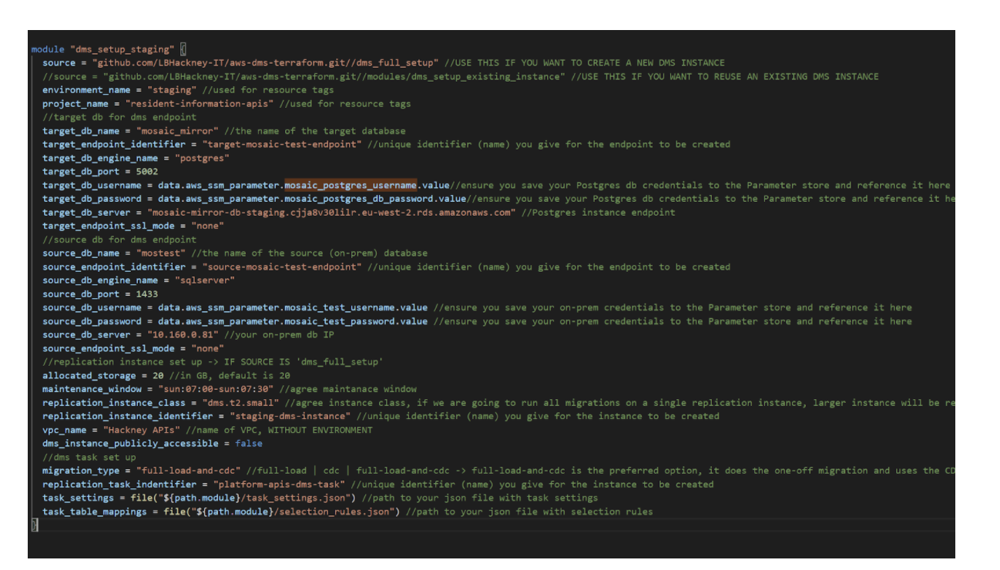
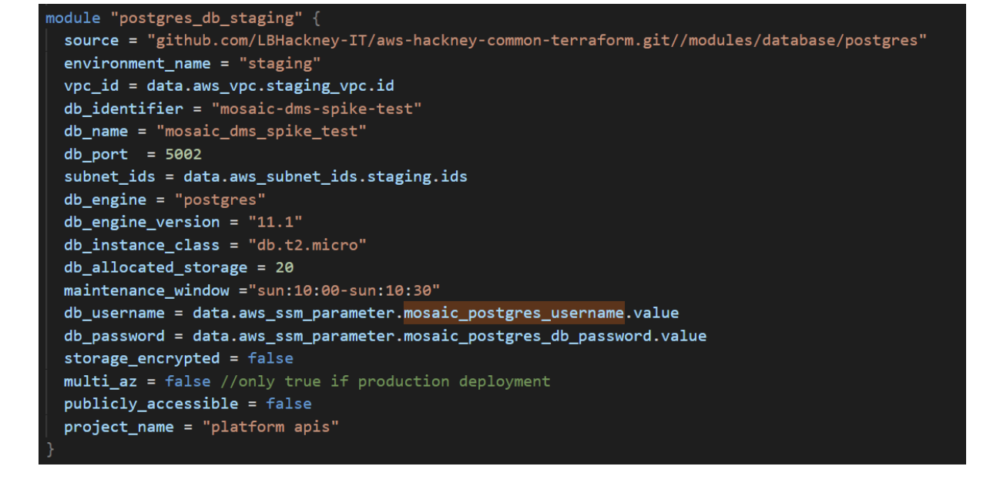
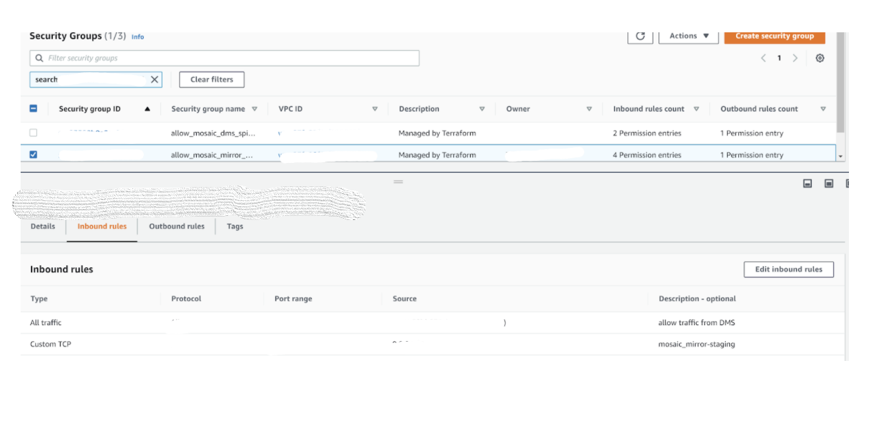
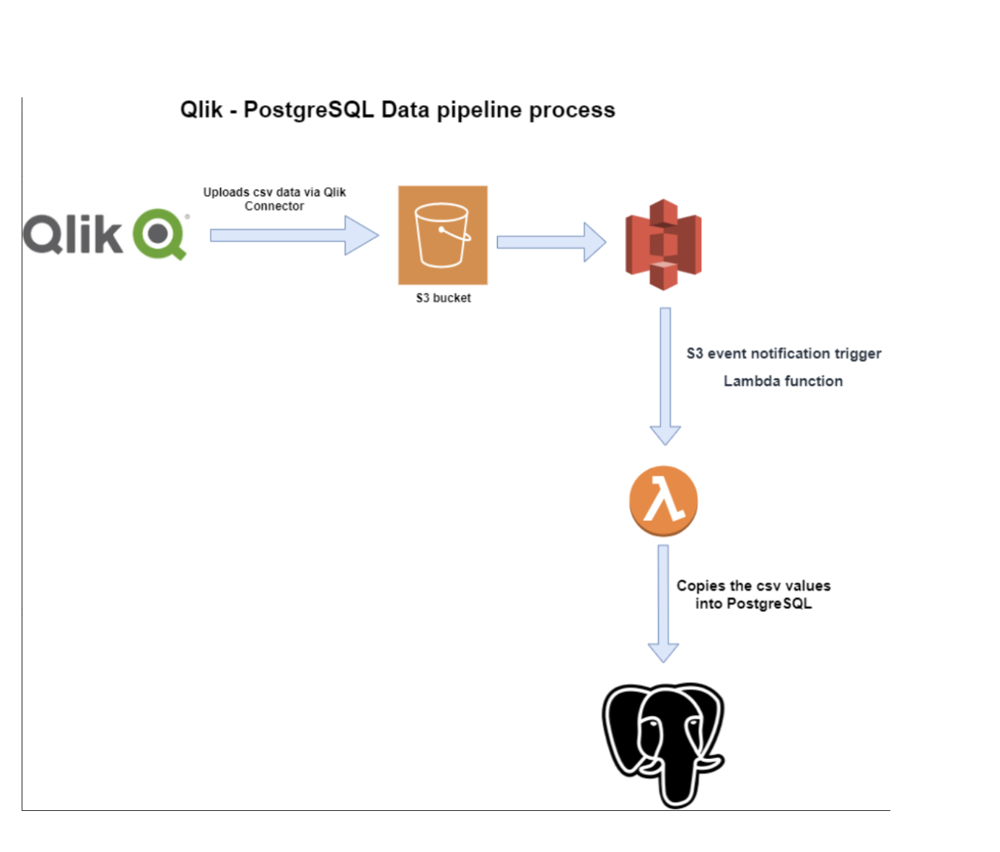

# What is AWS DMS?

AWS Data Migration Service (DMS) is a service that allows us to migrate data between a source (in our case, on-premises database) and a target (in our case, Postgres database hosted in AWS).

## DMS supported replication types

- **Continuous replication (CDC)**
  * When we want to do a one-off migration of all data and then continuously capture new inserts, updates and deletes and reflect them in our target database

- **One-off data migration**
  * When the goal is to migrate all data from a source, and is expected that changes will not be captured and reflected

# Which AWS DMS set up to use?

## For continuous migration

### CDC

CDC is a SQL server feature, available only on Enterprise and Developer editions.

It allows for changes to be captured (inserts/updates/deletes).

#### Use case

When the source database does not have primary keys and you want to migrate data continuously.

### MS Replication

MS Replication is a SQL server feature available on all editions.

It creates a “distribution” database and every time there is a change, it is captured and stored in the “distribution” database.

.MS will then read from that database to reflect the changes in the target database.

**Note:** The sql user created must have **sysadmin** permissions to set up replication

**Additional notes:** Configuration on the source database is required (please see below section). Additionally, SQL servers DO NOT come with MS replication features pre-installed, so the server might require a set up.

#### Use cases

- When you want to migrate data continuously

- When the SQL server is not Enterprise/Developer edition

- When the source database has tables, which make use of primary keys

## For one-off set up

  -  No database configuration is required

  - The sql user must have at least db_owner permissions

  - The replication runs ones and migrates the data specified

  - There are no subsequent runs of the migration task, unless triggered with other means

###  Use cases

  1. When only a one-off migration is required

  2. When the underlying source database is a reporting server and there are no possible ways to capture updates. In this scenario, we need to daily run a one-off migration, after the reporting server was updated with the latest data

# How to set up DMS

## Database set up

- [DMS with SQL CDC](https://docs.google.com/document/d/1EaZ-a8ejQwWQ40OGDGobxhTqtxXvtX9Ydk5mTFASUMo/edit)

- [DMS with MS Replication](https://docs.google.com/document/d/14kNirloRWXCnla08brXiTihCMIm24chygc1lGUjNVbE/edit?usp=sharing)

## AWS DMS set up via Terraform

Both DMS and Postgres can be created via Terraform.

### DMS

[Template repository and example usage](https://github.com/LBHackney-IT/aws-dms-terraform)

**Notes:**

- Follow the example usage, which also demonstrates how to add table mappings (specifying which tables are to be replicated)

- The source DB server should be specified with IP and not the server name

- DMS instance should be in the VPC, where the VPN is set up to ensure communication to on-prem is possible

- <u>  Make sure your DMS instance’s subnet group has only private subnets in it! </u>

### Postgres

[Template repository and example usage](https://github.com/LBHackney-IT/aws-hackney-common-terraform/tree/master/modules/database/postgres)

**Notes:**

 - DMS does not support Postgres version 12, so use version 11 or older.
 - Always store passwords in parameter store and do not hardcode them
 - “Multi_az” should be true for production databases
 - “subnet_ids” requires subnets in 2 different AZs. Make sure those are private subnets to ensure that the database is secure.
- Currently not terraformed: To enable traffic from DMS to your Postgres instance, ensure you add to the ingress rules of the database’s security group all traffic   from DMS security group.

## Data migration using a data pipeline

  ** What is a data pipeline? **

  A data pipeline is an automated flow that gets data stored in one location (source) and uploads it to a target destination.

### Data pipeline - CSV to Postgres

  As of 26/06/2020, we have implemented one data pipeline.

  The pipeline takes data uploaded in an S3 bucket in .csv format and uploads the data into a Postgres database.

  
