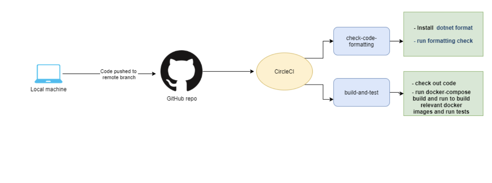
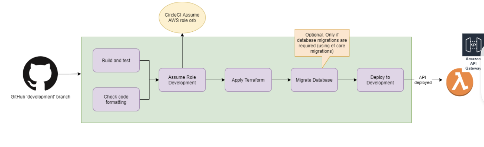
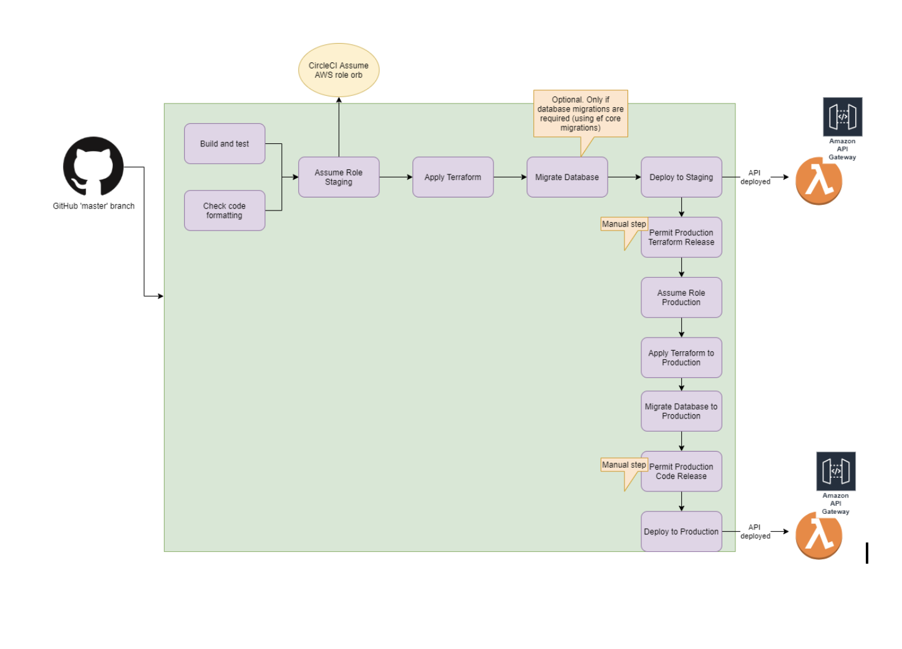
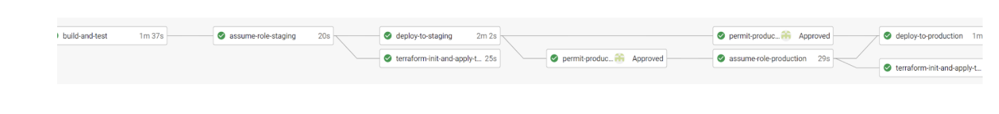

## Introduction

A Deployment pipeline is the process of taking code from a version control repo, such as Github, and releasing a version or the master branch to our deployment environments in an automated fashion.

## Video Tutorial

** For an overview of our Deployment Pipeline setup using Circle CI, please watch our short video tutorial: **

<figure class="video-container">
  <iframe width="100%" src="https://www.youtube.com/embed/X68e_wdII2c" title="YouTube video player" frameborder="0" allow="accelerometer; autoplay; clipboard-write; encrypted-media; gyroscope; picture-in-picture" allowfullscreen></iframe>
</figure>

## CI/CD

We use CI/CD in Hackney as an efficient way to build, test and deploy new code.
CI/CD is short for ** Continuous Integration and Continuous Delivery/Deployment ** .

** CI/CD works in conjunction with the following processes: **

- Version control (branches, commits, merges)
- Build automation/continuous integration
- Test automation
- Deploy automation

We use a combination of software functions in Github and Circle CI, configured via a YAML file to fully automate environment deployments. Our deployments will usually support a **development**, **staging**, and **production** environment.

The CI/CD YAML configuration is stored in a file in the `.circleci` folder. The YAML configuration contains all the steps which will be carried out in Circle CI as part of the deployment.

### Continuous testing

Unit and integration tests must be run as part of the CI/CD pipeline at the point of:

1. Code committed to remote branch
2. Deployment to different environments

We use the Test-Driven Development (TDD) approach when writing code.

Each project’s test suite must include units tests produced as part of TDD as well as integration tests.

** More on practices in Hackney for writing tests here: [TDD Practices](/tdd) **

## Environments

### Development

The deployment process is initiated via a push to a feature branch in Github. All branch pushes are built and code tests are run. Branches with failing tests or builds cannot be merged into the master branch which is used for deployments.

_Diagram of the process that happens when pushing code to GitHub_

#### Pull requests

Before a feature branch can be merged into development, after a successful build and test, it is marked for code review via a PR (Pull Request) in Github. You can use the [Base API PR template](https://github.com/LBHackney-IT/lbh-base-api/blob/master/pull_request_template.md), which needs to be completed with as much detail as possible, including a link to the JIRA ticket of the work done. There needs to be a minimum of 1 approver per PR prior to merging. An approved and merged PR will then trigger a CircleCI workflow to automatically deploy to the Development enviroment.

#### Workflow

_Merging into a ‘development’ branch triggers the ‘development deployment’ workflow_

The first steps for a deployment are usually the code formatting check, code build and test, deployment software tools installation, assignment of necessary security roles for deployments to AWS Lambda.

The successful completion of all of these steps will allow automated code deployment to the development environments.

### Staging and Production

_Merging into the ‘master’ branch automatically deploys to the staging environment_

In order to deploy to staging and production environments, manual approval in Circle CI is required as the final step.

_The CircleCI workflow_

The automation of the deployment to different environments gives flexibility in making small changes to the code and testing of features before deployment to a production environment.

Deployment automation means we decrease the possibility of human error when releasing new versions of code to deployment environments.