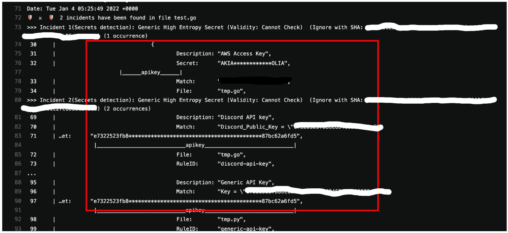

import TextToSpeech from '../src/SpeechComponent.js';

<TextToSpeech>

**GitGuardian**

**Purpose**

GitGuardian monitors both organisation repositories and developers' personal repositories. The solution gives visibility to developers and security teams on this very critical blindspot that is the Organisation's developers' personal repositories on GitHub.  It is the #1 app in the security category on the GitHub Marketplace.

**Context**

GitGuardian Public Monitoring is particularly interesting for companies with large development teams and modern development practices. It uses sophisticated pattern matching techniques to detect credentials that cannot be strictly defined with a distinctive pattern like unprefixed credentials. The built-in algorithm has high precision with real-time notifications. The alerting is done in real-time, which allows developers, security teams and operations managers to handle remediation operations.

**Main Benefits**
* Largest breadth of detection on the market (nearly 300 detectors)
* Optimised accuracy and recall to limit alert fatigue
* Natively integrated with the Software Life Cycle (Native VCS, SIEM, CI integrations)

**Why we use it at Hackney **

GitGuardian Internal Monitoring helps our Organisation detect and fix vulnerabilities in source code at every step of the software development lifecycle with automated secrets detection & remediation for private or public source code.

GitGuardian brings security and development teams together with automated remediation playbooks and collaboration features to resolve incidents fast and in full. By pulling developers closer to the remediation process, our Organisation can achieve higher incident closing rates and shorter fix times. 





**How we use it at Hackney **

At Hackney, we are using GitGuardian to prevent secrets from leaking into repositories both public and private.As we are already using Github, GitGuardian integration is easy to set up  and it can be actively included in our core CI/CD pipeline. 

GitGuardian can be installed by using the ggshield. This represents the  GitGuardian CLI application (Command Line Interface) to help developers detect more than 300 types of secrets, as well as other potential security vulnerabilities or policy breaks.

GitGuardian is a more general and robust solution to double-check the work done and make sure that if any developer is committing something, it only contains development IDs and not anything that is production-centric or customer-centric. 

For more information to setup ggshield, please visit the following link:

[https://docs.gitguardian.com/internal-repositories-monitoring/ggshield/getting_started](https://docs.gitguardian.com/internal-repositories-monitoring/ggshield/getting_started)

The ggshield Github repository is open-source and it can be found by visiting the link below:

[https://github.com/GitGuardian/ggshield](https://github.com/GitGuardian/ggshield)

The main way in which we're using GitGuardian at the moment is that it is connected through the GitHub integration. It is deployed through our code review process. When pull requests are created they connect with GitGuardian, which runs the scan before there is a review by one of our senior devs. In order to scan the full repo and old commits, you can use the following command: 


```
ggshield scan repo. 
```


Hence, it will scan the repo and show the results in the pipeline’s log as per the screenshot below: 

There is plenty of documentation available online and it is a very reliable tool to use. 

Some of the main sources of information are as follows :

* [GitGuardian main website - Learning Center ](https://www.gitguardian.com/secrets-detection)
* [GitGuardian Github Repository ](https://github.com/GitGuardian)
* [GitGuardian ggshield Github Repository](https://github.com/GitGuardian/ggshield)
* [Faun blog - How to scan Github repositories for secrets & credentials ?](https://faun.pub/how-to-scan-git-repository-for-secrets-credentials-4b397e720cab)

The scan for secrets in our codebase is one of the best features of GitGuardian.The instant alert of an open secret in the codebase is also a fantastic feature.

</TextToSpeech>