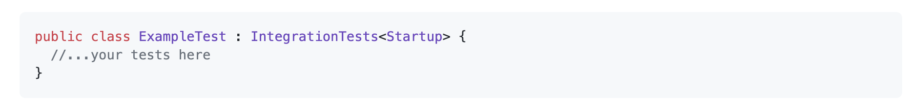
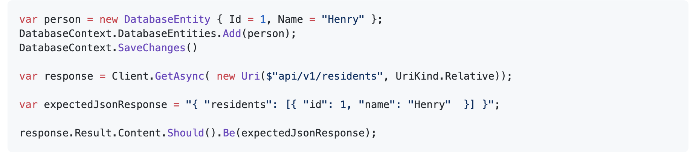
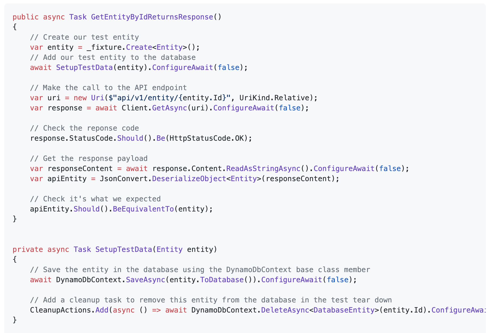

## Introduction

When creating a new endpoint or adding new functionality to an API it's good practice to start by writing an integration test outlining the functionality you are hoping to achieve. You can then write unit tests when you touch the individual classes you will be working on. Integration tests give you confidence that all your classes work together and that the full feature you have made is working correctly. These tests are slightly different depending on which database type is being employed: Postgres of DynamoDb.

## Postgres

To write Integration tests, inherit the IntegrationTest class for some useful test setup.

This will set up a web application factory so that you can make calls to endpoints, for example:

It will also set up a database connection and register it in a mock startup class. You can also use this connection in the test setup if you need to add anything to the database to test against.

An example of an integration test for a GET endpoint would be to add entities to the database and then assert they get returned in the response from the endpoint. Here is a simplified example of this.

## DynamoDb

** Database connection **

The DynamoDbIntegrationTests.OneTimeSetUp() method is what controls which database instance is used. It ensures that some environment variables that are later used in connecting to the DynamoDb instance are set.

## Database setup

** IMPORTANT: ** In order to ensure that the database instance used for the tests has all of the necessary tables created, update the DynamoDbIntegrationTests._tables collection with the necessary details. ** The details specifed here must match those that are set up by terraform, and those specified on any database entities.**

## Writing tests
To write Integration tests, inherit the DynamoDbIntegrationTests class for some useful test setup.

This will set up a web application factory so that you can make calls to endpoints, for example:

It will set up a database connection and register it in a mock startup class. You can also use this connection in the test setup if you need to add anything to the database to test against. The base class also maintains the ** CleanupActions  ** collection of actions that can be used to remove any data that may have been added to the database during the test.

** Example **

