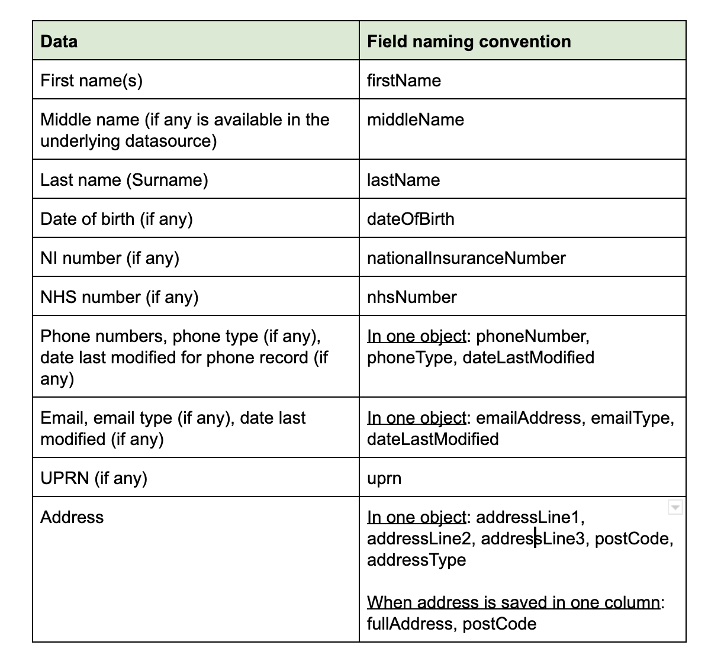

Name of the data source to represent the data:

Use ‘-’ to separate words

All lowercase.

For eg : mosaic-resident-information-api

Use of Views ?

Actual API output : translate the inner column names

For each individual Platform API:

