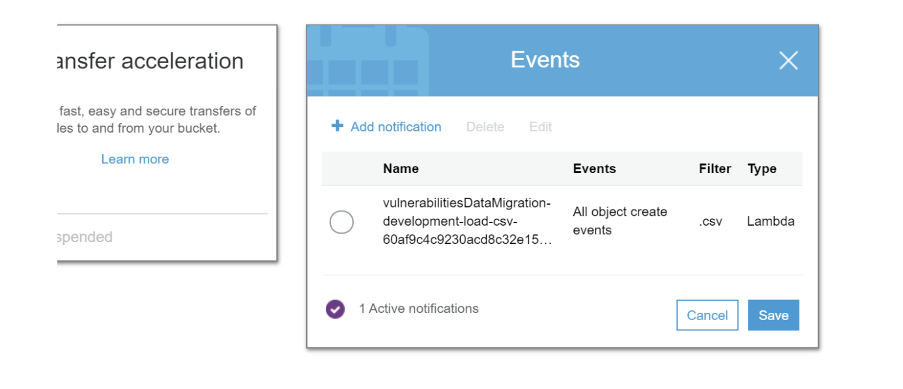
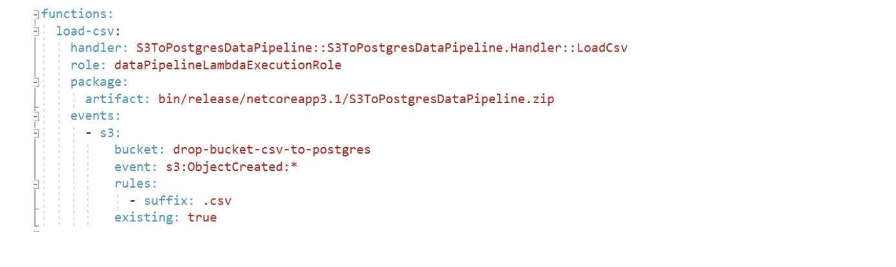

## S3

The source S3 bucket has been configured to invoke a Lambda function when a file has been uploaded with extension `.csv`.

The configuration for the source S3 bucket is done using the pipeline’s serverless implementation - <u> no manual set up is required for events </u>.

## Lambda 

The lambda function implements the following:

- Receives S3 notifications
- Retrieves bucket and file details from the notification
- Truncates the target table in the target database
- Makes use of AWS Postgres function that copies data from an csv file in S3 to Postgres to migrate the data
- Logs any exceptions and errors to Cloudwatch

 ** Note: The Postgres database and table to match the CSV format needs to be created separately. **

## How to set up the data pipeline for a project

[Template repository for the data pipeline code implementation](https://github.com/LBHackney-IT/s3-to-postgres-data-pipeline)

 1. Create a repository for your pipeline by using the above template
 2. Update the code by replacing the names of the existing pipeline to the name of your project’s pipeline
 3. Ensure you populate the specified environment variables in the README file of the repository
 4. Deploy using serverless - this will deploy the Lambda and it will set up an existing S3 bucket with the event it needs to listen for.

** Notes **

 - You need to create the S3 bucket separately and provide the name in the serverless.yml file of the pipeline repository.
 - You need to create the Postgres separately and create the table that will be the “target” with the same columns as the ones expected to be present in the .csv that will be uploaded to S3
