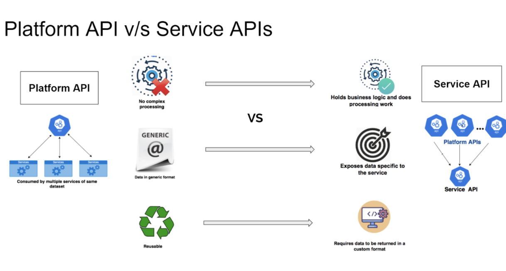
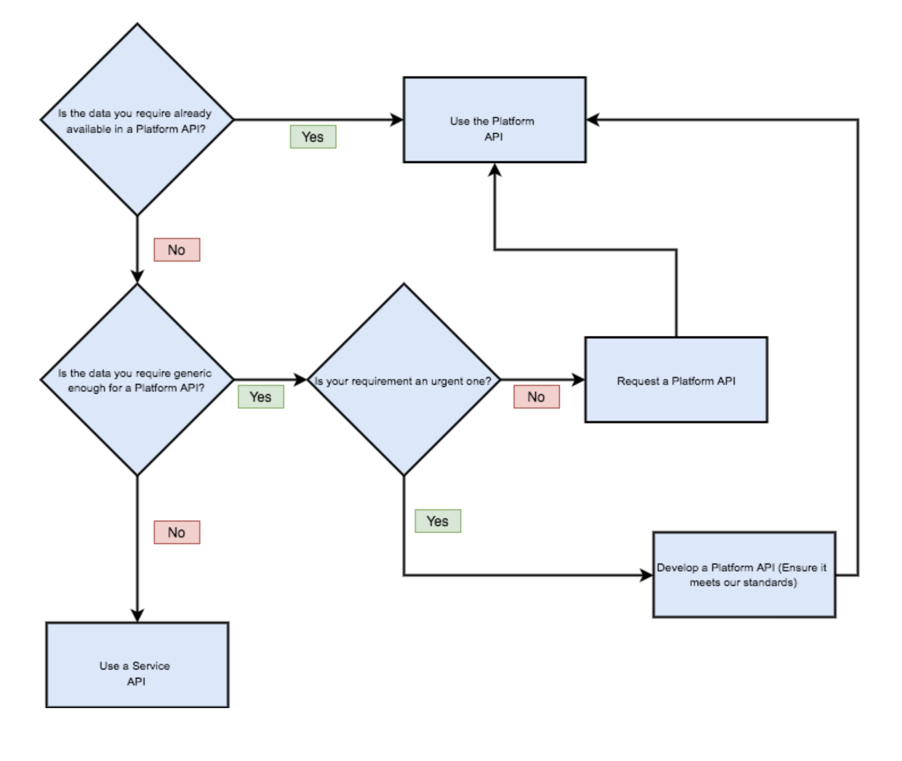

## A. Service APIs  

_Service APIs are used for specific data representation._

_Service APIs have additional data processing to satisfy a specific service need._

### Criteria

1. **Consumes 1 or more platform APIs and customise the JSON to their needs.**

   * Platform APIs is to provide all available data for a given domain (i.e. transactions) in a generic format. 
   * Service APIs should consume the platform API and modify the response object to meet their specific needs (if required).

2. **Holds business logic and does processing work on data to meet the specific needs of a service.**

   * Service APIs are to consume platform APIs to retrieve data from different domains. The service APIs can then process and modify the data in any way required to satisfy the given service requirement.

3. **Requires data to be returned in a custom format, different from the one exposed by platform APIs.**

4. **Exposes data specific to the service** 
   * e.g. Interactions data for Manage a tenancy - data not read or produced by any other service.

5. **We should only connect to a data source directly if reading or writing data that is not part of our data domain.**

   * This could be data generated by the service only used to satisfy service-specific requirements - for example, tenancy management interactions are data records specific to Manage a tenancy service.

   * If it is believed that data identified or generated by service should be exposed via a Platform API, please refer to the flowchart at the end of the document to verify.

##  B. Platform APIs

_Are data-driven, domain modeled APIs that expose generic data for re-use for several services of similar datasets. It is a holistic representation of a domain specified._

_It is the foundation layer for the <u> API ecosystem </u> allowing higher-level APIs access to the data sources below._

All platform APIs will be listed in our [API Hub](https://developer.api.hackney.gov.uk/).

### Criteria

1. **Used primarily for data persistence**
   * These APIs are responsible for reading and writing data to and from a given database.
   * It performs all CRUD (create, read, update and delete) operations, abstracting this away from consuming services.

2. **It contains the knowledge of the data domain and understands how to interact with the underlying data source.** 
   * If the data source changes, it should be the only place where this change needs to be updated.
   * This does not prevent a service API from connecting to a database to write its own service-specific data.  However, if it is interacting with the data domain this must be done via a Platform API.

   * <u> Example scenario: </u> Transactions API maps the domain model to the data structure of the current underlying data source - Universal Housing. In the future, if this data source is to be changed, Transactions API should be the only place where a ‘re-mapping’ to the new data source change is required. All services consuming the Transactions API would not be affected by the change.

3. **Designed to be consumed by multiple services.**
   * The data produced by Platform APIs should be generic enough to be useful for more than one service hence being reusable and consistent.

4. **Publishes its endpoint information for general consumption.**
   * The endpoint structure and usage descriptions should be publicly available via API Hub and in a clear, readable JSON format.

5. **Returns all data available for a given domain in a generic format (no custom naming convention is allowed)**
   * All fields for a given domain should be retrieved and returned as part of the response object of a platform API - no field should be selected based on the services needed.

   * As part of developing an API endpoint, Data & Insight team are to provide an agreed data domain model with universal naming for the fields returned as part of the response object. The platform API should map the data source response to the agreed naming for the data domain. The purpose of this requirement is to provide response objects that would be agnostic to the underlying data source field naming conventions.  

6. **It does not do any (complex) processing of data - it’s only purpose is to expose all available data from a given domain, without changing it.**

     * Any platform API should not do any logical processing of data to satisfy a requirement - it should only go to the underlying data source, retrieve or update the data, map it to the domain model defined and return the response object.

##   Decision Flowchart

** To determine if you require a Service API or a Platform API **

[**View the Miro board for higher resolution**](https://miro.com/app/board/o9J_lFTB0GI=/)

