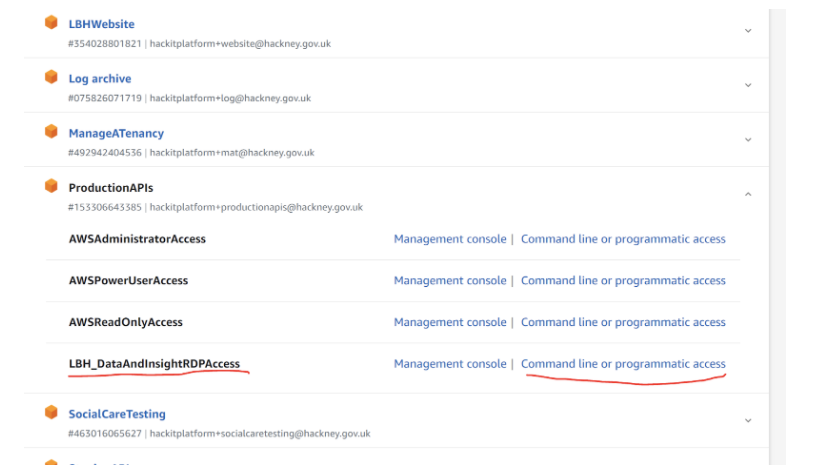
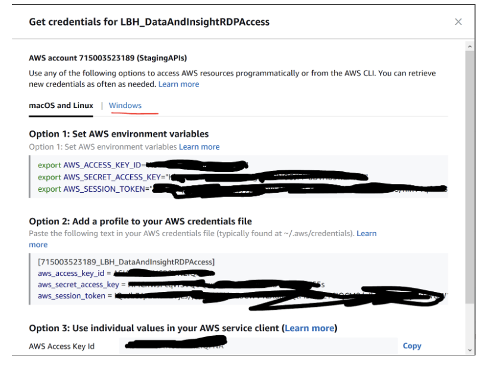
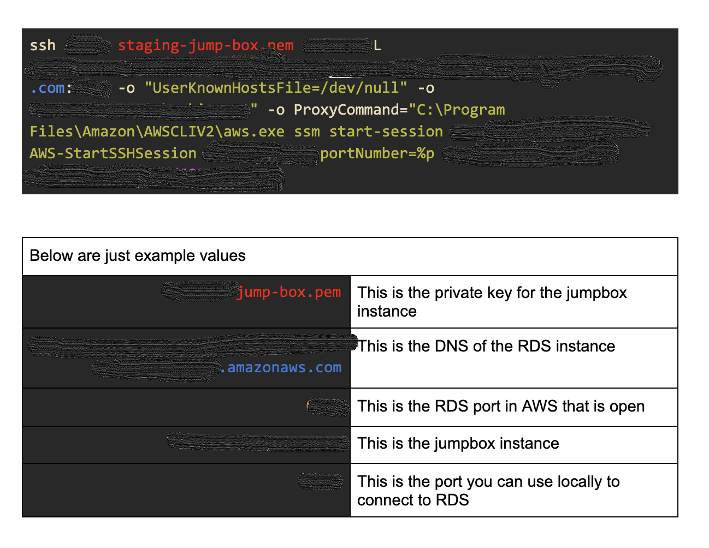

## Securely connecting to an AWS RDS instance

The instructions will help you connect to an AWS RDS instance without the need for that RDS resource to have a publicly available DNS. This connection can be made using a database client such as pgadmin.  You will utilise AWS session manager to connect to a Bastion host (or jumpbox) within the same AWS account as your desired RDS database.

## Pre-requisites

1. The AWS CLI installed - [guide](https://docs.aws.amazon.com/cli/latest/userguide/install-cliv2.html
)

2. The AWS session manager plugin installed - [guide](https://docs.aws.amazon.com/systems-manager/latest/userguide/session-manager-working-with-install-plugin.html)

3. A SSH client installed - [guide for Windows](https://docs.microsoft.com/en-us/windows-server/administration/openssh/openssh_install_firstuse)

4. Your Google account be given the relevant permissions to the AWS account and the EC2 instance (jumpbox)
5. The instance ID of the jumpbox
6. The private key for the EC2 instance that you will be connecting through

** You will also need : **

- The DNS of the RDS instance you want to connect to

- The port that is open on that RDS instance

- The database within the RDS instance you want to connect to

- The database credentials for the RDS instance you want to connect to

## Steps

### 1 - AWS credentials 

Ensure that you have up to date AWS credentials for the account you want to access.

There are multiple ways to do this, you can read the guidance [here](https://docs.aws.amazon.com/cli/latest/userguide/cli-configure-files.html).

** Here we will describe one of them: **

1. Go to https://hackney.awsapps.com/start#/ and log in using your Google account credentials

2. Expand the account that you will need access to and click on “Command line or programmatic access” next to the role that you want to use.

The role you will be using will have been explained to you beforehand.

3. You are then provided with instructions on how to add the credentials you will be authenticating with (note macOs and Windows options).

### 2 - Connecting to RDS

** In a shell - run the below command replacing the values in the table below with the ones for your connection. **

You can then connect using your client on `127.0.0.1:9999`
