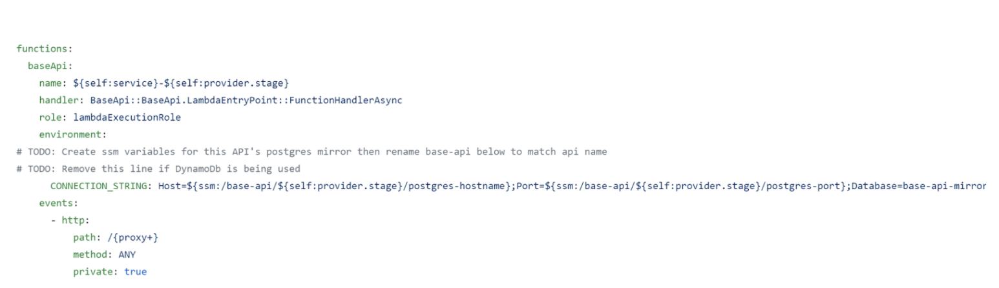
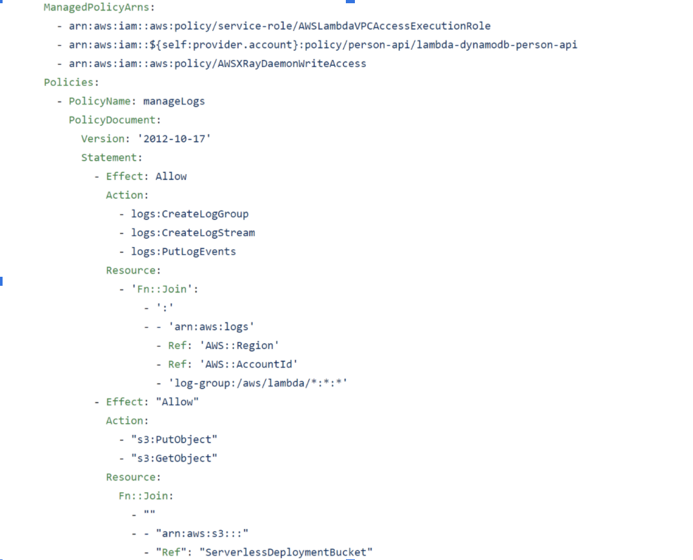
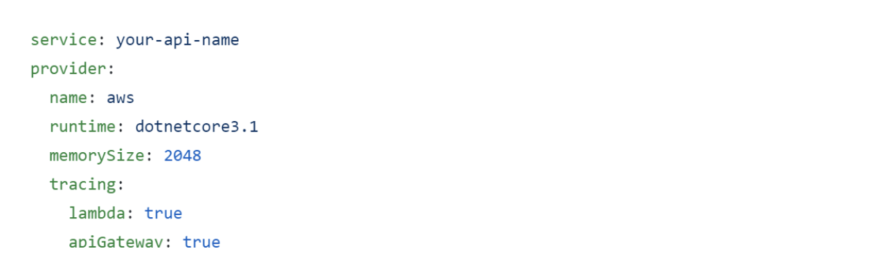

## What is Serverless Lambda?

The Serverless Framework provides support when developing and deploying AWS (Amazon Web Services) Lambda Functions, along with any AWS infrastructure resources that are required. The Serverless Framework provides a Command Line Interface (CLI) structure, automation and best practices out-of-the-box, hence allowing developers to focus on building sophisticated, event-driven, serverless architectures, composed of Functions and Events.

# Video Tutorial

** For a better understanding, you can start by having a look at our  Serverless Lambda Framework configuration tutorial: **

<iframe width="560" height="315" src="https://www.youtube.com/embed/EnID_C4yB_Y" title="YouTube video player" frameborder="0" allow="accelerometer; autoplay; clipboard-write; encrypted-media; gyroscope; picture-in-picture" allowfullscreen></iframe>

## Functions:

A function is an AWS Lambda function that is similar to a microservice. It’s simply code that is deployed in the cloud, this is mostly written as a single job. An example of a function could be to provide Database Credentials if you’re using PostgreSQL DB service(At Hackney we do not hard code this):

## Events:

Anything that triggers an AWS Lambda Function to execute is regarded by the Framework as an Event. Events are infrastructure events on AWS such as:
-An AWS API Gateway HTTP endpoint request
-An AWS S3 bucket upload
-When you define an event for your AWS Lambda functions in the Serverless Framework, the Framework will automatically create any infrastructure necessary for that event (e.g., an API Gateway endpoint) and configure your AWS Lambda Functions to listen to it.

## Resources:

Resources are AWS infrastructure components that your Functions use such as:
-An AWS DynamoDB Table
-An AWS S3 Bucket (e.g., for saving images or files)
-An AWS SNS Topic (e.g., for sending messages asynchronously)
-The Serverless Framework not only deploys your Functions and the Events that trigger them, but it also deploys the AWS infrastructure components your Functions depend upon.

## Services

A service is the framework’s unit of organisation, it’s where you define the functions, events which trigger them and resources that your functions use. A service can be described in a YAML or JSON format. Within Hackney, we define the service in the YAML format (serverless.yml) which is stored in the root directory of our projects.

#
