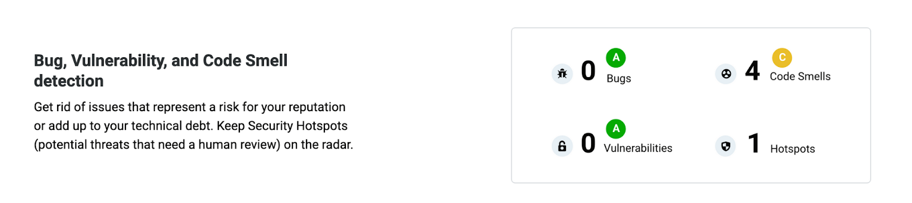
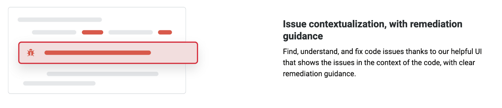
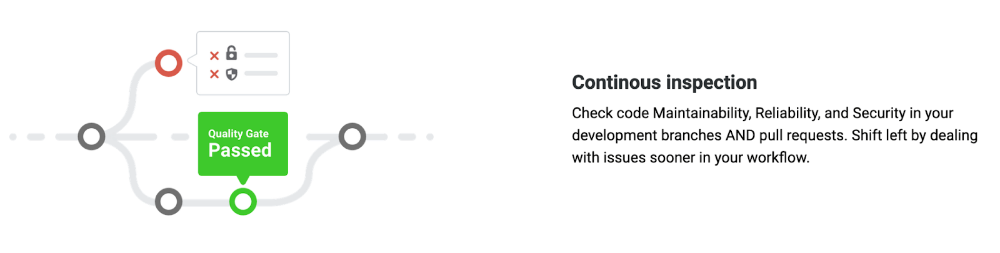

import TextToSpeech from '../src/SpeechComponent.js';

<TextToSpeech>

# What is SonarCloud

SonarCloud is a tool used to scan code to identify vulnerabilities, bugs and code smells. It supports all languages used within HackIT such as C# which requires additional setup 

Sonar cloud is mandatory to be setup for every public and private Hackney Repository

## Why SonarCloud is Used At Hackney

SonarCloud is enabled in our projects because it provides insight into the health of the Code. We use it to find, understand and fix issues since it highlights areas of our code that are vulnerable and presents these issues on a User Interface. It conceptualises the issues in context of the code and gives clear remediation guidance context with the code, for example, if there is a missing ‘alt’ attribute in an image tag then it would prompt you to include one and also give an explanation as to why it is important to include alt attribute in image tags.

## Benefits of SonarCloud

* Fast, continuous feedback on your code due to the static analysis feature that detects bugs and code smells in your repository.
* Quickly assess code health which means that developers are constantly updated on the status of their code.  
* Metrics are logged and available every moment of the development workflow. 
* Receive static analysis results directly from GitHub.
* When the SonarCloud checks fail, the deployment is stopped until the checks have been resolved. 
* Check code Maintainability, Reliability, and Security in your development branches AND pull requests. This makes code reviewing more efficient

SonarCloud provides an interface which highlights bugs and vulnerabilities, which is useful for us as it allows us to maintain programmes throughout its lifetime and respond to any errors which may arise especially after a new version release of an API or body of work.

## 

SonarCloud suggests possible fixes for an issue and shows the issue with context. Which enables us to form a deeper understanding of the problem and aids in the process of finding a working solution.

### Context 

Sonarcloud is already implemented in circleCI. We have created sonarcloud orbs. An orb is a reusable package of YAML configuration that condenses repeated pieces of config into a single line of code. These orbs are input into the config.yml file so that sonarcloud can be used.

### Code coverage  

SonarCloud supports the reporting of test coverage information as part of the analysis of your .NET project. 

https://www.codewrecks.com/post/github/github-sonarcloud-codecoverage/

</TextToSpeech>
