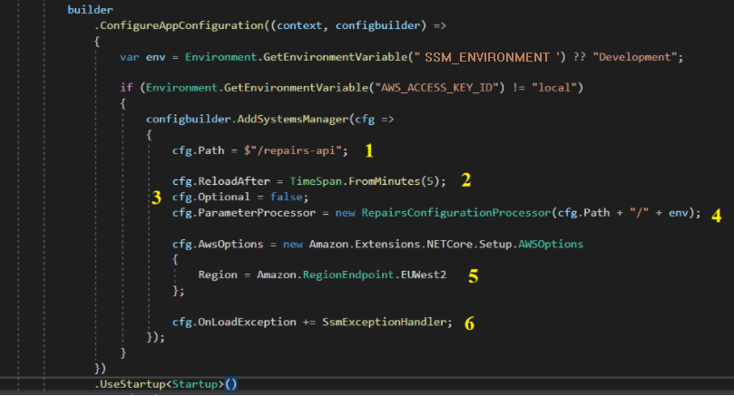

import TextToSpeech from '../src/SpeechComponent.js';

<TextToSpeech>

### Introduction

The standard method for deploying APIs and services at Hackney is via a lambda function. During deployment there is a hard limit of 4 KB of configuration data deployable with the function. Many apis and services that are mature have an increasing need for configuration data over and above this limit. This can include addresses and keys for other services, security tokens, and application-specific configuration data. Moreover, the increasing number of external integrations that Hackney is undertaking leads us to have less control over the length and type of these tokens. Therefore another method of exposing configuration data to the lambda runtime is required

### Theory

Under the Hackney standard template, configuration data is extracted from SSM via the sls deploy step. This runs in the context of the CircleCI deployment pipeline (see the Repairs example here). During the execution of this step, a call is made to SSM to retrieve each value, using the inferred key. When the .NET runtime starts the secrets are already available through the environment variables collection.

Instead, this method pulls the secrets from Systems Manager, not Secrets Manager) during the runtime start-up, while the host is being built. Specifically, a call is added to the call to Init(IWebHostBuilder builder) which will connect to SSM using the permissions in the lambda execution role (see step 3c, AWS example here). It is important to note that this process executes in the context of the lambda execution role and not the circleCI deployment role as before.

### Process
1. Add the package to your project
        The required package is Amazon.Extensions.Configuration.SystemsManager. Version 3.0.0 was used in Repairs.
2. Configure the package to pull secrets
    - For nominal runtime use, add a call to AddSystemsManager() to the lambda entry point Init() builder call chain. For projects based on the Hackney core template, this is in LamdaEntryPoint.cs. See below for an explanation of the relevant properties



1. The path (i.e. the prefix) to filter the parameter store keys by. For example, setting the path to “/repairs-api” will retrieve only those keys starting with /repairs-api
2. The ```reloadAfter``` property will set the timeout after which the runtime will periodically poll SSM for changes to the parameters. Not strictly necessary (the former way of configuration using serverless only refreshed upon redeployment, however can be useful for negatating the need to redeploy in some circumstances)
3. Setting ```optional = false``` will ensure an error is thrown if the configuration has not been properly retrieved*
4. A parameter processor is used for converting the key names in Systems Manager. More specifically, it is used to:
    - Trim the system name & environment variable & leading forward slash from the SSM parameter, for example:
    ```/repairs-api/staging/GatewayOptions/Gateway-Name```
    becomes
    ```GatewayOptions/Gateway-Name```
    - Replace the forward slashes (‘/’) in the secret name to the hierarchical separator for configuration in .NET, which is the colon character (‘:’). To continue the previous example, 
    ```GatewayOptions/Gateway-Name```
    becomes
    ```GatewayOptions:Gateway-Name```


5. Add the following managed policy to ManagedPolicyArns in the serverless config: ```arn:aws:iam::aws:policy/AmazonSSMReadOnlyAccess```
	This will allow the lambda to access SSM behind the scenes
6. Ensure that your ```SSM_ENVIRONMENT``` variable is set correctly. You can use any other environment variable that you are setting on a per-environment (development/staging/production) basis - as long as it is aligned with the names of the SSM secrets.
7. (Optional) Developer workstations. If you would like to get the integration working locally (instead of, for example, using a modified appsettings.Development.json, you can:
    - The code snippet above has been added to ```Program.cs``` (see [this PR](https://github.com/LBHackney-IT/repairs-api-dotnet/pull/584/files)). This is because by default, on boot, your workstation will fire up the ```main()``` method from ```Program.cs``` and not the lambda initialization method.
    - Add AWS access credentials to your local operating system environment (AWS_ACCESS_KEY_ID and AWS_SECRET_ACCESS_KEY). **DO NOT COMMIT** credentials to GitHub, even development ones :)


</TextToSpeech>