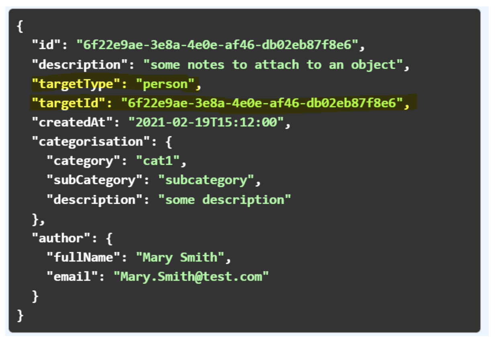

import TextToSpeech from '../src/SpeechComponent.js';

<TextToSpeech>

## Linking data via Target ID and Target Type:

# Background:

Using ‘target type’ and ‘target id’ is an approach to linking data entities started in Modern Tool for Housing and is already successfully followed for data entities such as Contact Details, Notes, Accounts, Activity History, Charges, etc.  
Approach

This is now an established common approach for linking data that we follow for new data entities in Hackney.

The approach provides a set of common data fields that allow us to link entities together. The corresponding APIs are then designed and developed in a way to utilise those common fields to provide a way to retrieve multiple records related to a single entity record.

As the set of fields is generic, it allows a link between one entity to any other entity - for example, a Notes record can be created against a Person, Property, Process, Account and any other entity we develop.

## Example:

A note record can be created against any record of any data entity by recording the target ID and target type.

- TargetId - the unique identifier of the record we are creating the note against;
- TargetType - the type of record we are creating the note against (e.g. person);

The same approach is followed for Contact details, Accounts, Activity History, etc.

## Benefits:

- Common way for linking data entities;
- Core entities’ records do not get overcrowded with holding data related to each record related to them;
- For example, instead of holding a list of document and note ids against a person record, each document and note related to that person holds the person id as a target id;
- Easier retrieval for data entities that hold multiple records related to the same single record;
- For example, retrieve all documents related to a person with a given id;
- Generic data structure to allow reuse of approach for any data entity, both current and future;
- For example, as Target ID could be the id of any record, a note would be able to be linked to any type of data entity;
- Target type will be used to distinguish the data entity type. Teams can use that information to know which Platform API to query if they want to retrieve further information about the target record;

</TextToSpeech>
