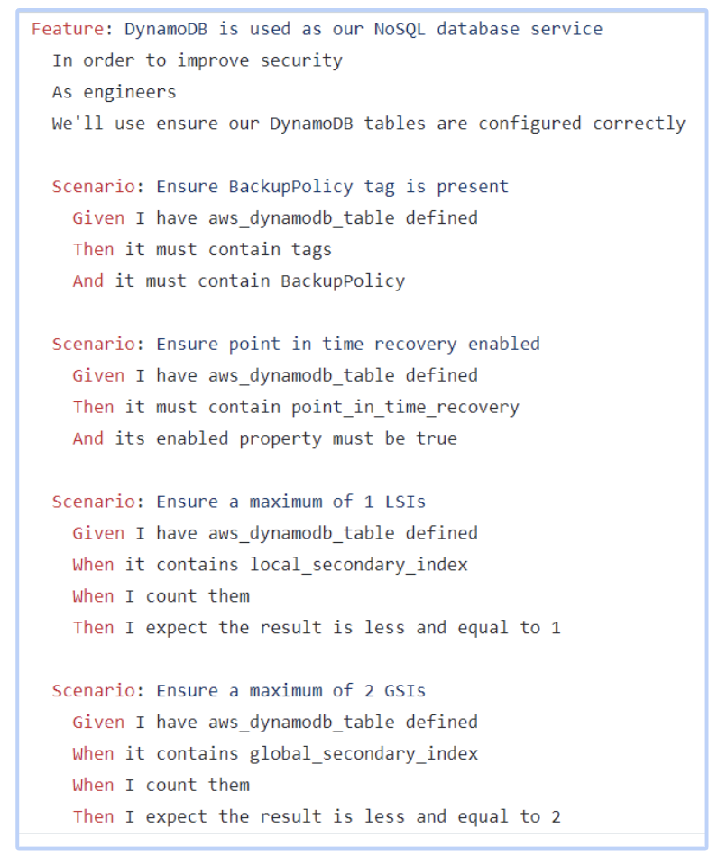
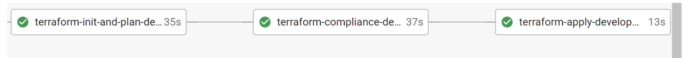
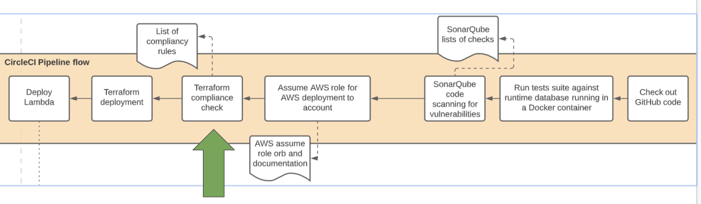

## What is Terraform?

- Tool for building and managing infrastructure as code
- Developers define resources that they want to provision in the cloud provider of their choice
- Resources are defined using code in Terraform configuration files
- Terraform generates an execution plan and is responsible for applying it (actually creating the resources) in AWS

 Within some of our Hackney services, the individual services (both FE and APIs) that we provide are responsible for provisioning any infrastructure required for that specific service - for example:
- Each API repository also holds the terraform responsible for provisioning the DynamoDB table used solely by this API to serve data.fi
- The infrastructure gets provisioned during the deployment of the API.

## What is Terraform Compliance?

- Lightweight, security and compliance focused test framework for terraform infrastructure-as-code
- Ensures the code implemented meets security requirements
- Standards can be customised.

## Benefits

- Every cloud resource created by a service is cross checked against a set of compliance rules defined by us.
- The checks are performed prior to provisioning the resources - if one or more checks fail, the deployment is stopped.

The checks help us ensure that the infrastructure provisioned during deployment is:

** Secure ** - e.g. we check that a database created is not accidentally marked as publicly accessible

** Cost efficient ** - e.g. an instance is not set up as large when not needed

** Available ** - e.g. the minimum instance count for a production service is two

** Keeping data safe ** - e.g. ensuring encryption is enabled

** Ensuring corporate wide strategies are followed ** - e.g. BackupPolicy tags

## Writting Compliance rules

To write the Terraform-compliance tests, feature files are used and written using Radish (Python BDD tool). Feature files all have 3 main components which are:
- Feature
- Scenario/Scenario outline
- Steps

These three components are all described with examples here:

https://terraform-compliance.com/pages/bdd-references/

## How to implement it?

1. Install Terraform Compliance
2. Run Terraform Plan
3. Run Terraform Compliance

Previously within HackIT we would first use Terraform init and then apply straight away. However, in order to complete the terraform compliance we need to first do terraform init and plan and then run the tests to ensure the infrastructure as code is setup correctly. Once those tests pass we can run terraform apply. However in order to complete the terraform compliance we need to first do terraform init and plan and then run the tests to ensure the infrastructure as code is setup correctly. Once those tests passes we can run terraform apply.

## CircleCI Pipeline Flow

## Video

<iframe src="https://drive.google.com/file/d/1mte6UDFZTCe6TgP6sLvxHnmg_qZaqWX2/preview" width="640" height="480" allow="autoplay"></iframe>
