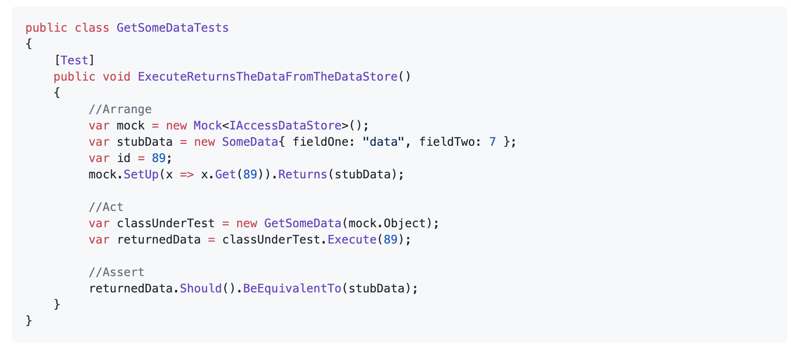
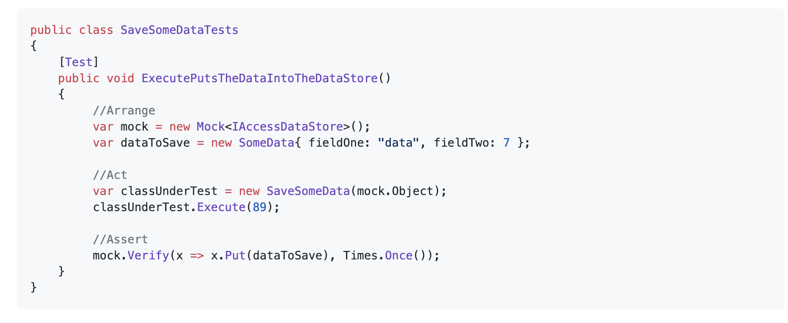

## Purpose

The purpose of this document is to demonstrate how we go about setting up our test environment.  
Once you've been through this document, you should be able to understand unit tests across the majority of our projects.

## Introduction

Unit tests are used to test the functionality of a class in isolation.
So if a class depends on another we will need to mock any interactions with that class. We are using <u> dependency injection </u>  so any class which needs to interact with another will be passed an interface, which the depended on class subscribes to, in the constructor.
In the tests, we can then just pass in a mock implementation of this interface into the constructor instead.

There is some good advice for mocking and writing unit tests here:

https://docs.microsoft.com/en-us/dotnet/core/testing/unit-testing-best-practices

## Setting up and using mocks

You can use mocks to return a specific value for a given input. For example a test for the following code:

might look like..

Or you can assert that they were called with the correct inputs. For example a test for the following code..

might look like..

These examples are just a couple of common use cases for using Moq, check out the documentation link below for more examples and use cases:

https://github.com/Moq/moq4/wiki/Quickstart
